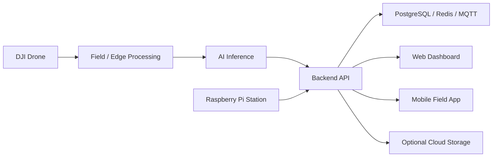

# AgroLens

> **Public case study — source code remains private.**

AgroTech platform for crop monitoring and disease detection using drones, computer vision, edge processing and cloud-connected applications.

## Recognition

- **2nd Place — Hult Prize PUCP**
- **2nd Place — START Latam**

## Product Scope

AgroLens is designed as a modular agricultural monitoring system with:

- DJI drone acquisition workflows
- Local inference and computer-vision processing
- Crop/model training workspace
- Operational backend
- Web dashboard
- Mobile field application
- Raspberry Pi field station
- Optional cloud storage for heavy evidence and backups

## Architecture

## Technology

`NestJS` · `Prisma` · `PostgreSQL` · `Python` · `Computer Vision` · `React` · `Vite` · `Expo` · `React Native` · `Kotlin` · `DJI MSDK` · `Raspberry Pi` · `Docker` · `Redis` · `MQTT` · `MinIO` · `AWS S3`

## Engineering Highlights

- Edge-first architecture for agricultural environments
- Separation of visual inference, model training and operational services
- Mobile and dashboard clients on top of a shared backend
- Raspberry Pi integration for field operation
- Infrastructure designed to keep critical workflows usable locally
- Cloud storage treated as an optional extension instead of a hard dependency
