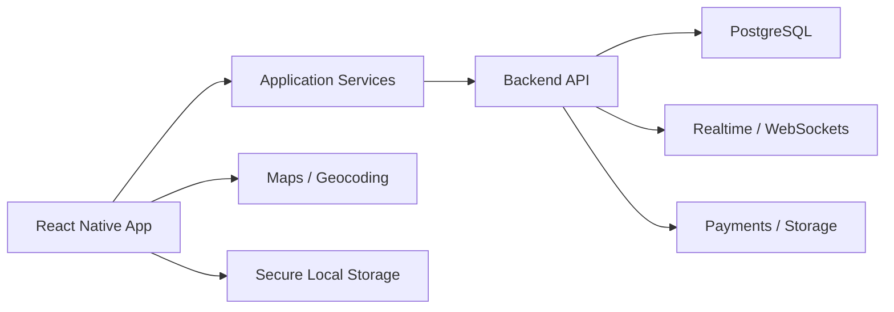

# CarLink

> **Public case study — source code remains private.**

Mobile application that combines **carpooling** with **professional networking**, designed around safer shared mobility and connection between students, graduates and young professionals.

## Product Concept

CarLink aims to connect people who share routes while adding a professional-networking layer to the mobility experience.

Key product areas include:

- Driver and passenger profiles
- Ride discovery and trip workflows
- Professional profiles and networking
- Ratings and trust signals
- Chat and communication
- Location and map experiences
- Authentication and onboarding
- Events and social interactions

## Architecture

## Technology

`React Native` · `Expo` · `Zustand` · `React Navigation` · `Axios` · `AsyncStorage` · `SecureStore` · `Leaflet` · `OpenStreetMap` · `Jest`

## Status

**MVP / active development.**

The public portfolio page focuses on product design and implemented mobile capabilities. Backend, payments and production integrations are treated as deployment architecture rather than claimed as fully production-complete.
