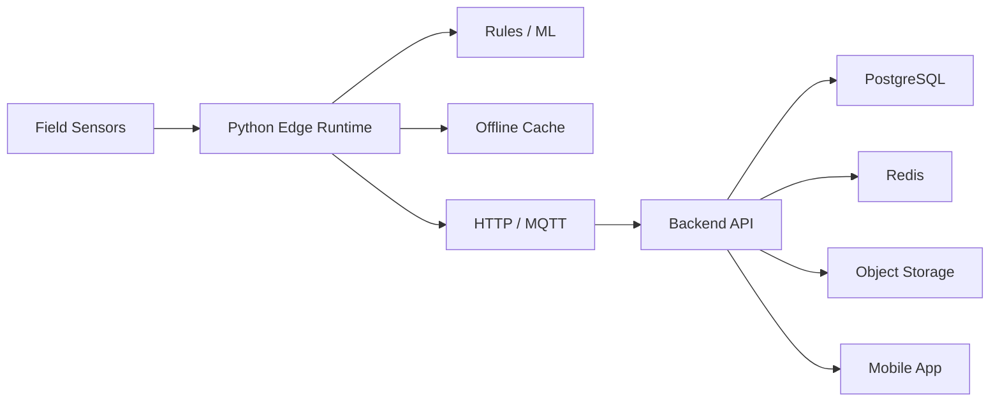

# CULTIVA+

> **Public case study — source code remains private.**

Smart-agriculture platform combining edge/IoT sensing, irrigation recommendations and a mobile/cloud application stack.

## Product Scope

The system is divided into two main layers:

### Edge / Native

- Environmental and agricultural sensor acquisition
- Real or simulated 7-in-1 sensor readings
- Irrigation recommendations using rules and ML
- Local JSON/CSV persistence
- Offline cache for connectivity loss
- HTTP or MQTT cloud publishing
- Local API for LAN/mobile access
- Dataset ETL and local model training

### Application Platform

- Mobile application
- Backend API
- Relational persistence
- Cache and object storage

## Architecture

## Technology

`Python` · `IoT` · `Machine Learning` · `MQTT` · `AWS IoT` · `NestJS` · `Prisma` · `PostgreSQL` · `Redis` · `MinIO` · `Expo` · `React Native`

## Engineering Highlights

- Edge-first operation
- Offline resilience
- Sensor-to-decision pipeline
- ETL and model-training workflows
- Multiple communication modes
- Separation between field intelligence and application services
