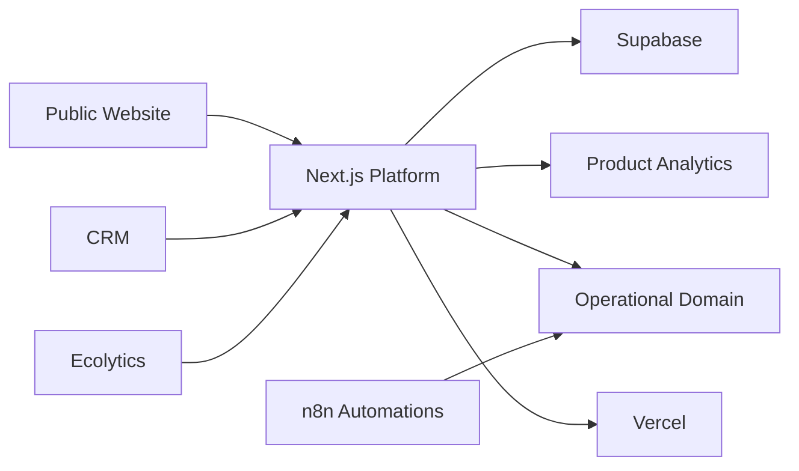

# ECORAIZ Platform

> **Public case study — source code remains private.**

Digital platform for a real-estate operation combining a public commercial website with protected internal tools for lead management, inventory workflows and analytics.

## Scope

ECORAIZ is structured as a product platform rather than a single landing page. The private monorepo includes:

- Public website built with **Next.js**
- Protected **CRM** workflows
- Internal **Ecolytics** analytics capabilities
- Authentication and profile-based access
- Inventory and operational domain contracts
- Event tracking and product analytics
- Automation specifications and operational workflows
- CI validation and deployment through Vercel

## Architecture

## Technology

`Next.js` · `React` · `TypeScript` · `Supabase` · `PostHog` · `Playwright` · `Turborepo` · `pnpm` · `Vercel` · `n8n`

## Engineering Highlights

- Separation between public and authenticated operational surfaces
- Role/profile-aware access to internal capabilities
- Versioned database and infrastructure preparation
- Automated lint, typecheck, build, domain tests and browser tests
- Product analytics and event instrumentation
- Real-estate inventory and lead-management workflows

## Why the repository is private

The operational repository contains business logic, internal workflows, infrastructure configuration and implementation details that should not be exposed in a public portfolio repository.

This case study intentionally documents only the architecture and product scope.
