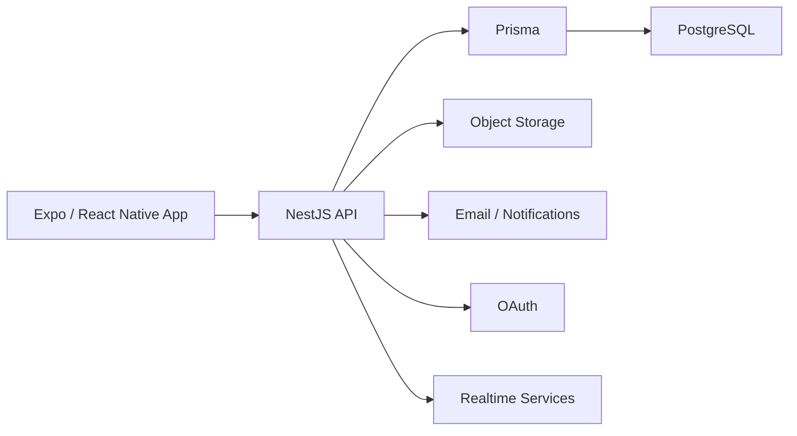

# Goaly

> **Public case study — source code remains private.**

Mobile personal-finance platform that combines day-to-day financial management with a formal backend architecture and cloud-ready integrations.

## Product Scope

Goaly supports workflows around:

- Accounts and transactions
- Transfers
- Categories
- Budgets
- Financial goals
- Debts
- Recurring payments and subscriptions
- OCR-assisted input
- Voice-assisted input
- Notifications
- Authentication and account recovery
- Export and account deletion

## Architecture

## Technology

`Expo` · `React Native` · `TypeScript` · `NestJS` · `Prisma` · `PostgreSQL` · `Socket.IO` · `Zustand` · `AWS SDK` · `S3` · `SES` · `OAuth` · `Docker`

## Engineering Highlights

- Mobile + backend separation
- Authenticated and guest/local modes
- Secure token storage on mobile
- Formal relational model through Prisma/PostgreSQL
- Realtime-capable backend
- Cloud-ready storage and email integrations
- Automated lint, build, unit and end-to-end verification
