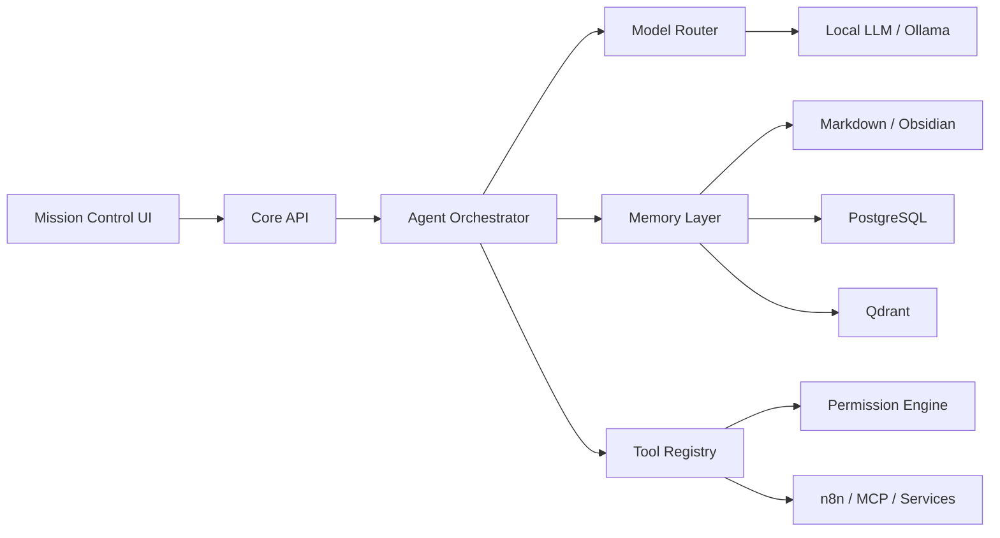

# Mina

> **Public case study — source code remains private.**

Local-first intelligent personal assistant designed as a modular cognitive workspace with persistent memory, specialized agents, automation and controlled tool execution.

## Core Idea

Mina goes beyond a conventional chatbot by combining:

- Persistent multi-layer memory
- Local Retrieval-Augmented Generation
- Specialized AI agents and an orchestrator
- Tool registry and permission controls
- Workflow automation
- Voice and vision services
- Mission-control interface
- Controlled autonomous tasks
- Local-first model execution with optional cloud extensions

## Architecture

## Technology

`TypeScript` · `Fastify` · `Ollama` · `PostgreSQL` · `Qdrant` · `Redis` · `RAG` · `n8n` · `MCP` · `Docker` · `Three.js` · `Voice` · `Computer Vision`

## Engineering Highlights

- Local-first architecture with graceful degradation
- Three-layer memory and semantic retrieval
- Multi-agent orchestration
- Permission levels for tool execution
- Auditable automation and controlled autonomous operation
- Modular model routing
- Voice, vision and interactive mission-control capabilities
